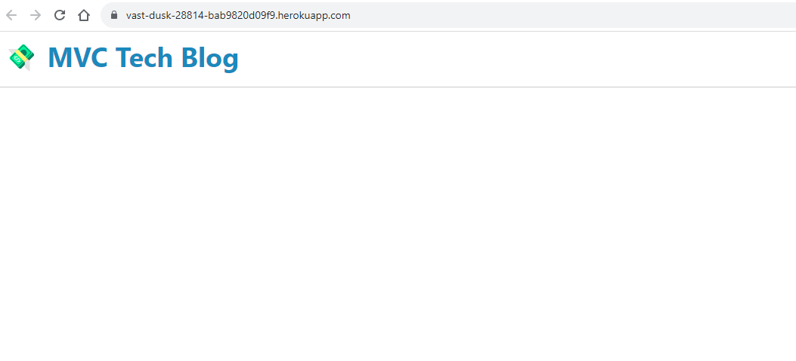

# MVC-Tech-Blog

## Description

As a developer who writes about tech, I Want a CMS-style blog site so that I can publish articles, blog posts, and my thoughts and opinions.

## Installation

To install code, run the following command:
Git clone <paste SSH key>

## Deployed Link

https://vast-dusk-28814-bab9820d09f9.herokuapp.com/

## Usage

## Process Steps

1. Created a unique GitHub repo for this project.
2. Created file structure
3. Created seeds and database
4. Created routes files with appropriate code to execute routes
